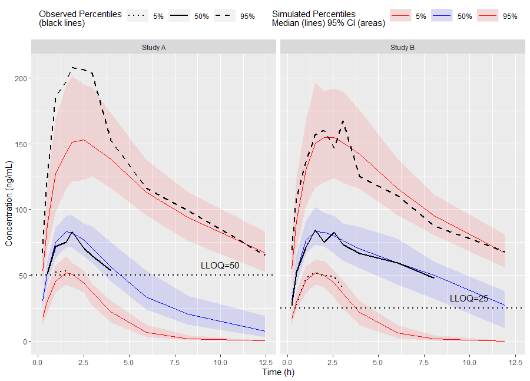
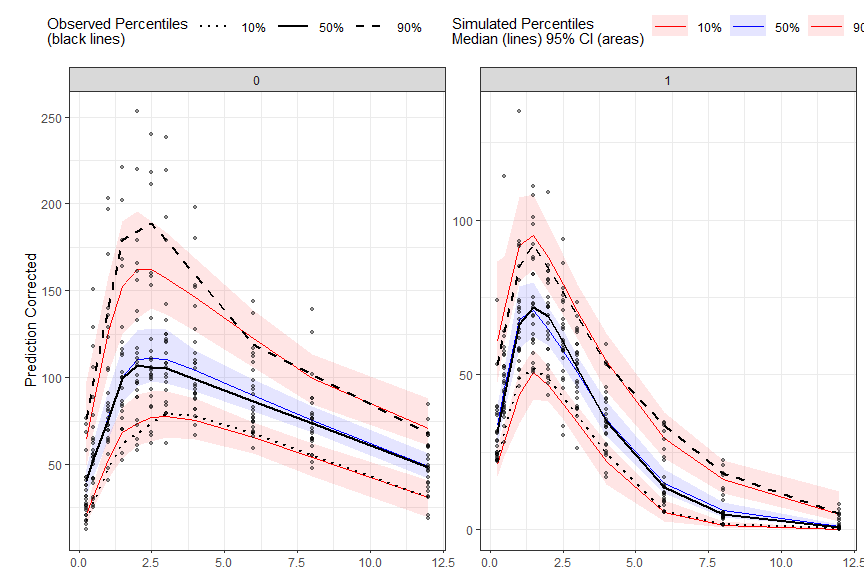

tidyvpc
========
<!-- badges: start -->
  [](https://travis-ci.org/jameswcraig/tidyvpc)
  <!-- badges: end -->
  
### Installation and Running information
```
# Install devtools if not previously installed.
# install.packages("devtools")
# If there are errors (converted from warning) during installation related to packages built under different version of R,
# they can be ignored by setting the environment variable R_REMOTES_NO_ERRORS_FROM_WARNINGS="true" before calling install_github()
Sys.setenv(R_REMOTES_NO_ERRORS_FROM_WARNINGS="true")
devtools::install_github("jameswcraig/tidyvpc")
```

### Usage

``` r
library(magrittr)
library(ggplot2)
library(tidyvpc)

# Filter MDV = 0
obs_data <- as.data.table(tidyvpc::obs_data)[MDV == 0]
sim_data <- as.data.table(tidyvpc::sim_data)[MDV == 0]

#Add LLOQ for each Study 
obs_data$LLOQ <- obs_data[, ifelse(STUDY == "Study A", 50, 25)]

# Binning Method on x-variable (NTIME)
vpc <- observed(obs_data, x=TIME, y=DV) %>%
    simulated(sim_data, y=DV) %>%
    censoring(blq=(DV < LLOQ), lloq=LLOQ) %>%
    stratify(~ STUDY) %>%
    binning(bin = NTIME) %>%
    vpcstats()

```


Plot Code:

``` r
ggplot(vpc$stats, aes(x=xbin)) +
    facet_grid(~ STUDY) +
    geom_ribbon(aes(ymin=lo, ymax=hi, fill=qname, col=qname, group=qname), alpha=0.1, col=NA) +
    geom_line(aes(y=md, col=qname, group=qname)) +
    geom_line(aes(y=y, linetype=qname), size=1) +
    geom_hline(data=unique(obs_data[, .(STUDY, LLOQ)]),
        aes(yintercept=LLOQ), linetype="dotted", size=1) +
    geom_text(data=unique(obs_data[, .(STUDY, LLOQ)]),
        aes(x=10, y=LLOQ, label=paste("LLOQ", LLOQ, sep="="),), vjust=-1) +
    scale_colour_manual(
        name="Simulated Percentiles\nMedian (lines) 95% CI (areas)",
        breaks=c("q0.05", "q0.5", "q0.95"),
        values=c("red", "blue", "red"),
        labels=c("5%", "50%", "95%")) +
    scale_fill_manual(
        name="Simulated Percentiles\nMedian (lines) 95% CI (areas)",
        breaks=c("q0.05", "q0.5", "q0.95"),
        values=c("red", "blue", "red"),
        labels=c("5%", "50%", "95%")) +
    scale_linetype_manual(
        name="Observed Percentiles\n(black lines)",
        breaks=c("q0.05", "q0.5", "q0.95"),
        values=c("dotted", "solid", "dashed"),
        labels=c("5%", "50%", "95%")) +
    guides(
        fill=guide_legend(order=2),
        colour=guide_legend(order=2),
        linetype=guide_legend(order=1)) +
    theme(
        legend.position="top",
        legend.key.width=grid::unit(1, "cm")) +
    labs(x="Time (h)", y="Concentration (ng/mL)")
```
Or use the built in `plot()` function from the tidyvpc package.

```{r}
# Binless method using 10%, 50%, 90% quantiles and LOESS Prediction Corrected
obs_data$PRED <- obs_data[REP == 1, PRED]

vpc <- observed(obs_data, x=TIME, y=DV) %>%
    simulated(sim_data, y=DV) %>%
    stratify(~ GENDER) %>%
    predcorrect(pred=PRED) %>%
    binless(qpred = c(0.1, 0.5, 0.9), loess.ypc = TRUE) %>%
    vpcstats()

plot(vpc)
```



### Shiny Application

The `tidyvpc` package contains a wrapper function to install necessary dependencies and run the [Shiny-VPC Application](https://github.com/jameswcraig/shiny-vpc).
Use the `runShinyVPC()` function from `tidyvpc` to parameterize VPC from a GUI and generate correpsponding `tidyvpc` 
and `ggplot2` code to reproduce VPC in your local R session. 

```{r}
runShinyVPC()
```
*Note: Internet access is required to use `runShinyVPC()`*